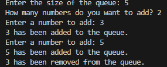

### **<u>Experiment No:</u> 02**

### **<u>Experiment Name:</u> Implementing Queue without STL** 

<br>

### **<u>Theory:</u>**
                 
<br>                 
  
    A queue is a linear data structure that follows the FIFO (First In, First Out) principle. The first element added to the queue is the first one to be removed. A queue typically has two main operations: enqueue (to add an element to the end) and dequeue (to remove an element from the front). It can be implemented using arrays, linked lists, or other data structures. In this experiment, we are using an array to implement the queue without utilizing the Standard Template Library (STL).
      

<br> <br>


### **<u>Code:</u>**
<br>

```#include <iostream>
using namespace std;

class SimpleQueue {
    int front, rear;    // 'front' is the first in line, 'rear' is the last
    int* queue;         // The queue to hold the numbers
    int maxSize;        // The biggest size the queue can be

public:
    // Constructor to set the size of the queue
    SimpleQueue(int size) {
        maxSize = size;            // Set the maximum size
        queue = new int[maxSize];  // Create the queue with the given size
        front = -1;                // The queue starts empty
        rear = -1;
    }

    // Add a number to the queue (Enqueue)
    void enqueue(int number) {
        if (rear == maxSize - 1) { // If the queue is full
            cout << "The queue is full!\n";
        } else {
            if (front == -1)       // If it's the first number being added
                front = 0;         // Set the front to the first position
            rear++;                // Move 'rear' to the next position
            queue[rear] = number;  // Add the number to the 'rear' position
            cout << number << " has been added to the queue.\n";
        }
    }

    // Remove the first number from the queue (Dequeue)
    void dequeue() {
        if (front == -1 || front > rear) {  // If the queue is empty
            cout << "The queue is empty, nothing to remove!\n";
        } else {
            cout << queue[front] << " has been removed from the queue.\n";
            front++;                // Move 'front' to the next position
        }
    }

    // Destructor to clean up the memory when done
    ~SimpleQueue() {
        delete[] queue;            // Delete the queue to free up memory
    }
};

int main() {
    int size, howMany, number;

    // Ask the user for the size of the queue
    cout << "Enter the size of the queue: ";
    cin >> size;

    // Create a queue of that size
    SimpleQueue myQueue(size);

    // Ask how many numbers they want to add
    cout << "How many numbers do you want to add? ";
    cin >> howMany;

    // Add the numbers to the queue
    for (int i = 0; i < howMany; i++) {
        cout << "Enter a number to add: ";
        cin >> number;
        myQueue.enqueue(number);  // Add the number
    }

    // Remove the first number from the queue
    myQueue.dequeue();            // Remove the first number

    return 0;
}


```


<br><br>


### **<u>Output:</u>** 
<br>

<div align="center">

<br>
<h4> Figure-1: Output of Queue Implementation </h4> 
</div>


<br><br>


### **<u>Discussion:</u>** 
<br>
In this experiment, we implemented a queue using an array without the STL, adhering to the FIFO principle. The enqueue() function adds elements to the rear of the queue, and the dequeue() function removes elements from the front. We ensured proper error handling for both full and empty queue conditions, and memory is dynamically managed to avoid memory leaks. The user defines the queue size, and we demonstrated how elements are enqueued and dequeued, illustrating the basic queue operations.


