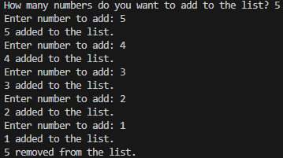

### **<u>Experiment No:</u> 03**

### **<u>Experiment Name:</u> Implementing Linked List without STL.** 

<br>

### **<u>Theory:</u>**
                 
<br>                 
  
A Linked List is a data structure used for storing collections of data. Unlike arrays, linked lists do not have a fixed size, and elements (called nodes) are connected using pointers. Each node contains two parts: data and a pointer to the next node in the list. There are three main types of linked lists:

    Singly Linked List: Each node points to the next node, forming a chain.
    Doubly Linked List: Each node points to both the next and previous nodes.
    Circular Linked List: The last node points back to the first node.
      

<br> <br>


### **<u>Code:</u>**
<br>

```#include <iostream>
using namespace std;

// Node structure to represent each element in the list
struct Node {
    int data;       // Data part of the node
    Node* next;     // Pointer to the next node
};

// Linked List class to manage the list
class SimpleLinkedList {
    Node* head;    // Head of the list (first node)

public:
    // Constructor to initialize the list
    SimpleLinkedList() {
        head = nullptr;  // Start with an empty list
    }

    // Add a new number to the end of the list
    void add(int value) {
        Node* newNode = new Node();  // Create a new node
        newNode->data = value;       // Set the data
        newNode->next = nullptr;     // The new node will be the last, so its next is null

        if (head == nullptr) {       // If the list is empty
            head = newNode;          // The new node becomes the head (first node)
        } else {
            Node* temp = head;       // Start from the head
            while (temp->next != nullptr) {
                temp = temp->next;   // Go to the end of the list
            }
            temp->next = newNode;    // Attach the new node at the end
        }
        cout << value << " added to the list.\n";
    }

    // Remove the first number from the list
    void remove() {
        if (head == nullptr) {       // Check if the list is empty
            cout << "The list is empty, nothing to remove.\n";
        } else {
            Node* temp = head;       // Store the current head
            head = head->next;       // Move the head to the next node
            cout << temp->data << " removed from the list.\n";
            delete temp;             // Delete the old head
        }
    }
};

int main() {
    SimpleLinkedList myList;  // Create an empty linked list
    int numberOfElements, element;

    // Ask how many numbers to add
    cout << "How many numbers do you want to add to the list? ";
    cin >> numberOfElements;

    // Add each number to the list
    for (int i = 0; i < numberOfElements; i++) {
        cout << "Enter number to add: ";
        cin >> element;
        myList.add(element);  // Add the number to the list
    }

    // Remove the first number from the list
    myList.remove();  // Remove the first element

    return 0;
}


```


<br><br>


### **<u>Output:</u>** 
<br>

<div align="center">

<br>
<h4> Figure-1: Output of Linked List Implementation </h4> 
</div>


<br><br>


### **<u>Discussion:</u>** 
<br>
In this experiment, we implemented a simple Singly Linked List without using the C++ Standard Template Library (STL). The program allows the user to add numbers to the linked list and remove the first element. Each node consists of two parts: the data (which stores the number) and a pointer to the next node in the list. When adding elements, we traverse to the end of the list and append the new node. Removing a node involves updating the head pointer to the next node, and the removed node is deleted to free memory.


