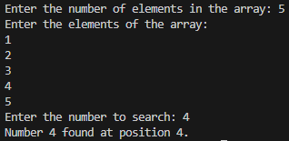

### **<u>Experiment No:</u> 04**

### **<u>Experiment Name:</u> Implementing Linear Search** 

<br>

### **<u>Theory:</u>**
                 
<br>                 
  
Linear Search is a simple search algorithm used to find an element in an array. In this method, we start at the beginning of the array and check each element one by one until we find the desired element or reach the end of the array. This approach works for both sorted and unsorted arrays but can be inefficient if the array is large because each element must be checked sequentially.
      

<br> <br>


### **<u>Code:</u>**
<br>

```#include <iostream>
using namespace std;

// Function to perform linear search
void linearSearch(int arr[], int size, int target) {
    bool found = false;  // Flag to indicate if the target is found
    
    for (int i = 0; i < size; i++) {
        if (arr[i] == target) {   // If the target is found
            cout << "Number " << target << " found at position " << i + 1 << ".\n";
            found = true;         // Mark as found
            break;                // Stop the search
        }
    }
    
    if (!found) {                 // If the number was not found
        cout << "Number " << target << " not found in the array.\n";
    }
}

int main() {
    int size, target;

    // Input the size of the array
    cout << "Enter the number of elements in the array: ";
    cin >> size;

    int arr[size];  // Declare an array of given size

    // Input array elements
    cout << "Enter the elements of the array: \n";
    for (int i = 0; i < size; i++) {
        cin >> arr[i];
    }

    // Input the target number to search
    cout << "Enter the number to search: ";
    cin >> target;

    // Perform linear search
    linearSearch(arr, size, target);

    return 0;
}


```


<br><br>


### **<u>Output:</u>** 
<br>

<div align="center">

<br>
<h4> Figure-1: Output of Linear Search Implementation </h4> 
</div>


<br><br>


### **<u>Discussion:</u>** 
<br>
In this experiment, we implemented a Linear Search algorithm, which sequentially checks each element of the array to find a target value. The program allows the user to input the array size, elements, and the target number to search. The search function compares the target with each element and prints the position when it finds a match. If the element is not found, it informs the user that the number is not in the array. This method is easy to implement but can be slow for larger arrays because it checks every element.


