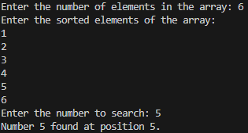

### **<u>Experiment No:</u> 05**

### **<u>Experiment Name:</u> Implementing Binary Search** 

<br>

### **<u>Theory:</u>**
                 
<br>                 
  
Binary Search is an efficient algorithm used to find an element in a sorted array. Instead of searching the entire array sequentially like Linear Search, Binary Search works by dividing the array in half at each step. If the target element is smaller than the middle element, the search continues in the left half, otherwise in the right half. This process is repeated until the target is found or the search space is empty. Binary Search has a time complexity of O(log n), making it faster than Linear Search for large arrays.
      

<br> <br>


### **<u>Code:</u>**
<br>

```#include <iostream>
using namespace std;

// Function to perform binary search
void binarySearch(int arr[], int size, int target) {
    int left = 0;                // Start of the array
    int right = size - 1;        // End of the array
    bool found = false;          // Flag to indicate if the target is found

    while (left <= right) {
        int middle = (left + right) / 2;  // Find the middle element

        if (arr[middle] == target) {      // If the target is found
            cout << "Number " << target << " found at position " << middle + 1 << ".\n";
            found = true;                 // Mark as found
            break;
        }
        else if (arr[middle] < target) {  // If target is greater, search in the right half
            left = middle + 1;
        } else {                          // If target is smaller, search in the left half
            right = middle - 1;
        }
    }

    if (!found) {                         // If the number was not found
        cout << "Number " << target << " not found in the array.\n";
    }
}

int main() {
    int size, target;

    // Input the size of the array
    cout << "Enter the number of elements in the array: ";
    cin >> size;

    int arr[size];  // Declare an array of given size

    // Input sorted array elements
    cout << "Enter the sorted elements of the array: \n";
    for (int i = 0; i < size; i++) {
        cin >> arr[i];
    }

    // Input the target number to search
    cout << "Enter the number to search: ";
    cin >> target;

    // Perform binary search
    binarySearch(arr, size, target);

    return 0;
}


```


<br><br>


### **<u>Output:</u>** 
<br>

<div align="center">

<br>
<h4> Figure-1: Output of Binary Search Implementation </h4> 
</div>


<br><br>


### **<u>Discussion:</u>** 
<br>
In this experiment, we implemented Binary Search, a more efficient searching method for sorted arrays. The program first takes a sorted array as input, then allows the user to search for a specific number. The search algorithm divides the array into halves, quickly narrowing down the search space. It is more efficient than Linear Search, especially for larger datasets, due to its logarithmic time complexity (O(log n)). However, Binary Search requires the array to be sorted beforehand, which can be a limitation in some cases.


