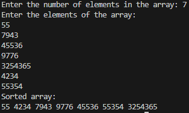

### **<u>Experiment No:</u> 06**

### **<u>Experiment Name:</u> Implementing Quick Sort** 

<br>

### **<u>Theory:</u>**
                 
<br>                 
  
Quick Sort is an efficient, recursive, divide-and-conquer sorting algorithm. It works by selecting a pivot element from the array and partitioning the other elements into two sub-arrays: those less than the pivot and those greater than the pivot. This process is repeated recursively for both sub-arrays. Quick Sort is known for its average-case time complexity of O(n log n), making it faster for large datasets. However, its worst-case time complexity is O(n²) when the smallest or largest element is consistently chosen as the pivot.
      

<br> <br>


### **<u>Code:</u>**
<br>

```#include <iostream>
using namespace std;

// Function to swap two elements
void swap(int* a, int* b) {
    int temp = *a;
    *a = *b;
    *b = temp;
}

// Partition function to place pivot in correct position
int partition(int arr[], int low, int high) {
    int pivot = arr[high];  // Select the last element as the pivot
    int i = (low - 1);      // Index of the smaller element

    for (int j = low; j <= high - 1; j++) {
        if (arr[j] < pivot) {  // If current element is smaller than the pivot
            i++;               // Increment the index of the smaller element
            swap(&arr[i], &arr[j]);  // Swap elements
        }
    }
    swap(&arr[i + 1], &arr[high]);  // Place the pivot in the correct position
    return (i + 1);                 // Return the index of the pivot
}

// Quick Sort function
void quickSort(int arr[], int low, int high) {
    if (low < high) {
        int pi = partition(arr, low, high);  // Find the pivot index

        quickSort(arr, low, pi - 1);   // Sort elements before the pivot
        quickSort(arr, pi + 1, high);  // Sort elements after the pivot
    }
}

int main() {
    int size;

    // Input the size of the array
    cout << "Enter the number of elements in the array: ";
    cin >> size;

    int arr[size];  // Declare an array of given size

    // Input array elements
    cout << "Enter the elements of the array: \n";
    for (int i = 0; i < size; i++) {
        cin >> arr[i];
    }

    // Perform Quick Sort
    quickSort(arr, 0, size - 1);

    // Output the sorted array
    cout << "Sorted array: \n";
    for (int i = 0; i < size; i++) {
        cout << arr[i] << " ";
    }
    cout << endl;

    return 0;
}


```


<br><br>


### **<u>Output:</u>** 
<br>

<div align="center">

<br>
<h4> Figure-1: Output of Quick Sort Implementation </h4> 
</div>


<br><br>


### **<u>Discussion:</u>** 
<br>
In this experiment, we implemented the Quick Sort algorithm. The program takes an array of numbers and sorts them using a divide-and-conquer approach. It selects a pivot element and arranges the array such that elements smaller than the pivot are on the left, and larger elements are on the right. This process is repeated recursively until the array is sorted. Quick Sort is one of the fastest sorting algorithms for average cases with a time complexity of O(n log n), but care must be taken to avoid the worst-case scenario by choosing a good pivot.


