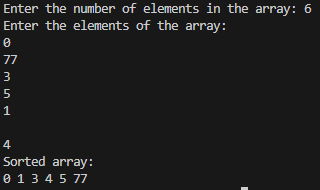

### **<u>Experiment No:</u> 07**

### **<u>Experiment Name:</u> Implementing Selection Sort** 

<br>

### **<u>Theory:</u>**
                 
<br>                 
  
Selection Sort is a simple comparison-based sorting algorithm. It works by repeatedly selecting the smallest (or largest) element from the unsorted portion of the array and swapping it with the first unsorted element. This process is repeated until the entire array is sorted. The algorithm has a time complexity of O(n²), making it inefficient for large arrays. However, it is easy to understand and implement for smaller datasets.
      

<br> <br>


### **<u>Code:</u>**
<br>

```#include <iostream>
using namespace std;

// Function to swap two elements
void swap(int* a, int* b) {
    int temp = *a;
    *a = *b;
    *b = temp;
}

// Selection Sort function
void selectionSort(int arr[], int size) {
    for (int i = 0; i < size - 1; i++) {
        int minIndex = i;  // Assume the first unsorted element is the smallest
        
        // Find the smallest element in the unsorted portion
        for (int j = i + 1; j < size; j++) {
            if (arr[j] < arr[minIndex]) {
                minIndex = j;  // Update minIndex if a smaller element is found
            }
        }
        
        // Swap the found minimum element with the first unsorted element
        swap(&arr[minIndex], &arr[i]);
    }
}

int main() {
    int size;

    // Input the size of the array
    cout << "Enter the number of elements in the array: ";
    cin >> size;

    int arr[size];  // Declare an array of given size

    // Input array elements
    cout << "Enter the elements of the array: \n";
    for (int i = 0; i < size; i++) {
        cin >> arr[i];
    }

    // Perform Selection Sort
    selectionSort(arr, size);

    // Output the sorted array
    cout << "Sorted array: \n";
    for (int i = 0; i < size; i++) {
        cout << arr[i] << " ";
    }
    cout << endl;

    return 0;
}


```


<br><br>


### **<u>Output:</u>** 
<br>

<div align="center">

<br>
<h4> Figure-1: Output of Selection Sort Implementation </h4> 
</div>


<br><br>


### **<u>Discussion:</u>** 
<br>
In this experiment, we implemented the Selection Sort algorithm. The program sorts an array by repeatedly finding the minimum element from the unsorted portion of the array and placing it at the beginning. This process is continued until the entire array is sorted. Though the algorithm is easy to understand, it has a time complexity of O(n²), making it inefficient for larger datasets compared to more advanced sorting algorithms like Quick Sort. However, it is still a useful tool for educational purposes and small datasets.


