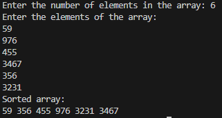

### **<u>Experiment No:</u> 08**

### **<u>Experiment Name:</u> Implementing Bubble Sort** 

<br>

### **<u>Theory:</u>**
                 
<br>                 
  
Bubble Sort is one of the simplest sorting algorithms. It repeatedly compares adjacent elements of the array and swaps them if they are in the wrong order. This process is repeated until the array is sorted. The algorithm is called "Bubble Sort" because larger elements "bubble up" to their correct position with each pass. Its time complexity is O(n²), making it inefficient for large datasets, but it's useful for understanding basic sorting concepts.
      

<br> <br>


### **<u>Code:</u>**
<br>

```#include <iostream>
using namespace std;

// Bubble Sort function
void bubbleSort(int arr[], int size) {
    for (int i = 0; i < size - 1; i++) {
        for (int j = 0; j < size - i - 1; j++) {
            if (arr[j] > arr[j + 1]) {  // Compare adjacent elements
                // Swap if they are in the wrong order
                int temp = arr[j];
                arr[j] = arr[j + 1];
                arr[j + 1] = temp;
            }
        }
    }
}

int main() {
    int size;

    // Input the size of the array
    cout << "Enter the number of elements in the array: ";
    cin >> size;

    int arr[size];  // Declare an array of given size

    // Input array elements
    cout << "Enter the elements of the array: \n";
    for (int i = 0; i < size; i++) {
        cin >> arr[i];
    }

    // Perform Bubble Sort
    bubbleSort(arr, size);

    // Output the sorted array
    cout << "Sorted array: \n";
    for (int i = 0; i < size; i++) {
        cout << arr[i] << " ";
    }
    cout << endl;

    return 0;
}


```


<br><br>


### **<u>Output:</u>** 
<br>

<div align="center">

<br>
<h4> Figure-1: Output of Bubble Sort Implementation </h4> 
</div>


<br><br>


### **<u>Discussion:</u>** 
<br>
In this experiment, we implemented the Bubble Sort algorithm. The algorithm works by repeatedly comparing adjacent elements and swapping them if they are in the wrong order, with larger elements gradually moving to the end of the array. Though easy to implement and understand, Bubble Sort is not suitable for large datasets due to its time complexity of O(n²). It is most useful for small arrays or for educational purposes to demonstrate the fundamentals of sorting.


