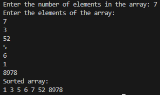

### **<u>Experiment No:</u> 09**

### **<u>Experiment Name:</u> Implementing Insertion Sort** 

<br>

### **<u>Theory:</u>**
                 
<br>                 
  
Insertion Sort is a simple sorting algorithm that works similarly to the way you might sort playing cards in your hands. The array is virtually split into two parts: sorted and unsorted. The algorithm picks elements from the unsorted part and inserts them into their correct position in the sorted part. It is efficient for small datasets and mostly sorted data, with a time complexity of O(n²) in the worst case and O(n) in the best case.
      

<br> <br>


### **<u>Code:</u>**
<br>

```#include <iostream>
using namespace std;

// Insertion Sort function
void insertionSort(int arr[], int size) {
    for (int i = 1; i < size; i++) {
        int key = arr[i];  // Element to be inserted into the sorted part
        int j = i - 1;

        // Move elements of arr[0...i-1] that are greater than key to one position ahead
        while (j >= 0 && arr[j] > key) {
            arr[j + 1] = arr[j];
            j = j - 1;
        }
        arr[j + 1] = key;  // Place the key at its correct position
    }
}

int main() {
    int size;

    // Input the size of the array
    cout << "Enter the number of elements in the array: ";
    cin >> size;

    int arr[size];  // Declare an array of given size

    // Input array elements
    cout << "Enter the elements of the array: \n";
    for (int i = 0; i < size; i++) {
        cin >> arr[i];
    }

    // Perform Insertion Sort
    insertionSort(arr, size);

    // Output the sorted array
    cout << "Sorted array: \n";
    for (int i = 0; i < size; i++) {
        cout << arr[i] << " ";
    }
    cout << endl;

    return 0;
}


```


<br><br>


### **<u>Output:</u>** 
<br>

<div align="center">

<br>
<h4> Figure-1: Output of Insertion Sort Implementation </h4> 
</div>


<br><br>


### **<u>Discussion:</u>** 
<br>
In this experiment, we implemented the Insertion Sort algorithm. The algorithm builds a sorted array one element at a time by picking elements from the unsorted part and inserting them into their correct position in the sorted part. This makes the algorithm particularly efficient for small datasets or datasets that are already mostly sorted, with a time complexity of O(n) in the best case. However, its worst-case complexity of O(n²) makes it less suitable for large datasets.


