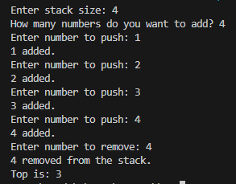

### **<u>Experiment No:</u> 01**

### **<u>Experiment Name:</u> Implementing Stack without STL** 

<br>

### **<u>Theory:</u>**
                 
<br>                 
  
    A stack is a linear data structure that follows the Last In First Out (LIFO) principle. It means that the element added last will be removed first. A stack can be implemented using arrays or linked lists. In this experiment, we will implement a stack using an array without using any Standard Template Library (STL).

    Basic operations of a stack:

        Push: Adds an element to the stack.
        Pop: Removes the top element from the stack.
      

<br> <br>


### **<u>Code:</u>**
<br>

```#include <iostream>
using namespace std;

class SimpleStack {
    int top;           // This tells us where the top of the stack is
    int* stackArray;   // Array to store stack elements
    int maxSize;       // Maximum size of the stack

public:
    // Constructor to define the stack size
    SimpleStack(int size) {
        maxSize = size;              // Set the maximum size
        stackArray = new int[maxSize];  // Create an array with that size
        top = -1;                    // Start with the stack empty
    }

    // Add a number to the stack (Push)
    void push(int number) {
        if (top == maxSize - 1) {     // Check if stack is full
            cout << "Stack is full.\n";
        } else {
            top++;                    // Move top up by 1
            stackArray[top] = number; // Add the number to the top
            cout << number << " added.\n";
        }
    }

    // Remove the top number from the stack (Pop)
    void pop() {
        if (top == -1) {              // Check if stack is empty
            cout << "Stack is empty, nothing to pop.\n";
        } else {
            cout << stackArray[top] << " removed from the stack.\n";
            top--;                    // Move top down by 1
        }
    }

    // Destructor to clean up memory
    ~SimpleStack() {
        delete[] stackArray;          // Free memory
    }
};

int main() {
    int size, numberOfElements, element;
    
    // Input stack size
    cout << "Enter stack size: ";
    cin >> size;

    SimpleStack myStack(size);  // Create stack with user-defined size

    // Input number of elements to push
    cout << "How many numbers do you want to add? ";
    cin >> numberOfElements;

    // Input elements and push them to the stack
    for (int i = 0; i < numberOfElements; i++) {
        cout << "Enter number to push: ";
        cin >> element;
        myStack.push(element);  // Push user input into the stack
    }

    // Pop the top element
    myStack.pop();              // Remove the top number

    return 0;
}

```


<br><br>


### **<u>Output:</u>** 
<br>

<div align="center">

<br>
<h4> Figure-1: Output of Stack Implementation </h4> 
</div>


<br><br>


### **<u>Discussion:</u>** 
<br>
In this experiment, we implemented a basic stack data structure using a dynamically allocated array in C++, without the STL. The stack follows the LIFO (Last In, First Out) principle, where the last element pushed is the first to be popped. The `push()` method adds elements to the stack while ensuring it doesn't exceed its user-defined size, and the `pop()` method removes the top element, checking if the stack is empty beforehand. The stack size is specified by the user, and memory is managed properly through a destructor. This simple implementation demonstrates key stack operations and error handling for full or empty stacks.


